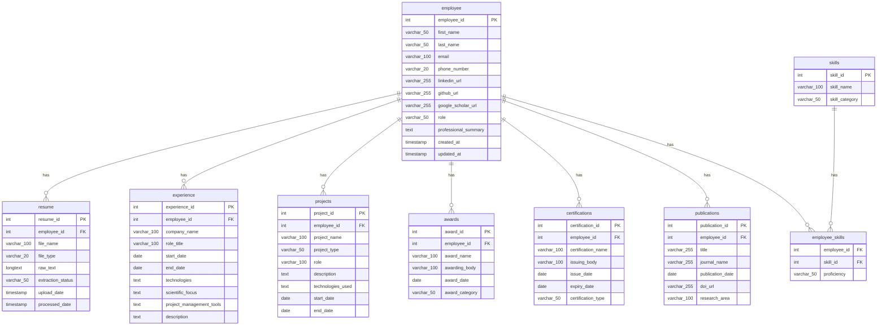

# Resume ERD

## Notes

- `employee_skills` is the join table for the many-to-many relationship between `employee` and `skills`.
- `employee_skills.employee_id` + `employee_skills.skill_id` should be treated as a composite primary key.
- The ERD mirrors the schema shown in your reference diagram.
